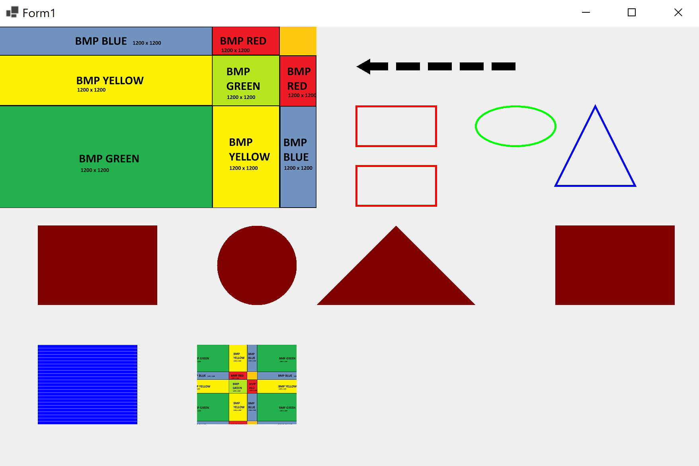

# winforms-graphics

## About 

This is an example Winforms project to show how to add graphics such as lines, shapes, and images onto a Winforms application.

This project was created as part of a tutorial by MUO on How to Add Graphics to a C# Windows Form Application.

## To Run

### From Visual Studio
* Download or clone the project to your local computer.
* Inside the GraphicsApp folder, open "GraphicsApp.sln", which is the solution file for the project.
* Press the green "Play" button at the top of Visual Studio to start the application. 

### As an executable file
* Navigate to "/GraphicsApp/bin/Debug/netcoreapp3.1".
* Click to Open the file "GraphicsApp.exe".

## Project Files
* form1.cs (Code) - This includes the entire example code for the article. The code to create graphics is inside the Form1_Paint(...) function.
* form1.cs (Designer) - This shows the canvas. When you open it, the canvas is empty at design time (because the shapes are generated at runtime). This area is where you can view properties and event handlers, and where the Form1_Paint(...) event handler is added (as shown in the article).

 

